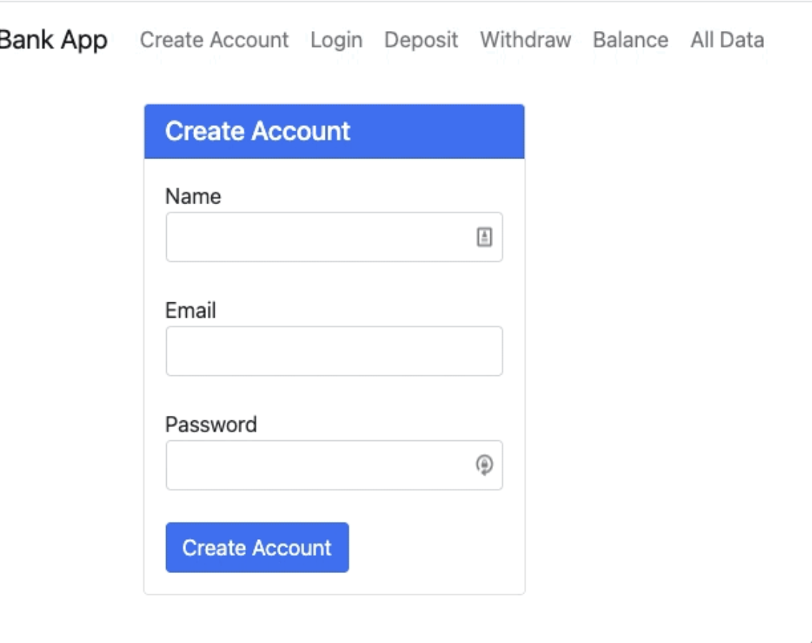

# BankCrypto App With MongoDB

## Description/Motivation
This was a capstone project for the "MIT xPRO Professional Certificate in Coding: Full Stack Development with MERN program".

In this project I demostrate the setting up of the FrontEnd interacting with Express Server APIs. Server side uses MongoDB in Docker and holds users account data.

## Installation
In order to make the project run, you have to go through the following steps:

1. Clone the repository [Ref](https://docs.github.com/en/repositories/creating-and-managing-repositories/cloning-a-repository)
```
git clone https://github.com/dicotips/bankcrypto-with-mongodb
```

2. You will need Node.js, Docker and MongoDB isntalled in your computer.
   1. [Node.js](https://nodejs.org/en/)
   2. [Docker](https://docs.docker.com/get-docker/)
   3. [MongoDB](https://docs.mongodb.com/manual/administration/install-community/)
      1. [Robo 3T](https://robomongo.org/): GUI to interact with MongoDB database.

3. Once the project is in your computer, install the dependencies:

```
cd bankcrypto-with-mongodb
npm install
```

4. Create a MongoDB database instance in docker:
```
docker run -p 27017:27017 -name bank-app -d mongo
```

5. Stalt Express server:  

```
npm start
```

6. Open your favorite browser with the URL: http://localhost:3000

## Screen Capture



## Technology used:
* HTML  
* CSS  
* Javascript  
* React
* Express  
* Node.js  
* Docker  
* MongoDB  

## Features
This app allows the insert, read, and updating data in a MongoDB database.

## MIT License

```
Copyright (c) 2022 Jheser Guzman

Permission is hereby granted, free of charge, to any person obtaining a copy
of this software and associated documentation files (the "Software"), to deal
in the Software without restriction, including without limitation the rights
to use, copy, modify, merge, publish, distribute, sublicense, and/or sell
copies of the Software, and to permit persons to whom the Software is
furnished to do so, subject to the following conditions:

The above copyright notice and this permission notice shall be included in all
copies or substantial portions of the Software.

THE SOFTWARE IS PROVIDED "AS IS", WITHOUT WARRANTY OF ANY KIND, EXPRESS OR
IMPLIED, INCLUDING BUT NOT LIMITED TO THE WARRANTIES OF MERCHANTABILITY,
FITNESS FOR A PARTICULAR PURPOSE AND NONINFRINGEMENT. IN NO EVENT SHALL THE
AUTHORS OR COPYRIGHT HOLDERS BE LIABLE FOR ANY CLAIM, DAMAGES OR OTHER
LIABILITY, WHETHER IN AN ACTION OF CONTRACT, TORT OR OTHERWISE, ARISING FROM,
OUT OF OR IN CONNECTION WITH THE SOFTWARE OR THE USE OR OTHER DEALINGS IN THE
SOFTWARE.
```